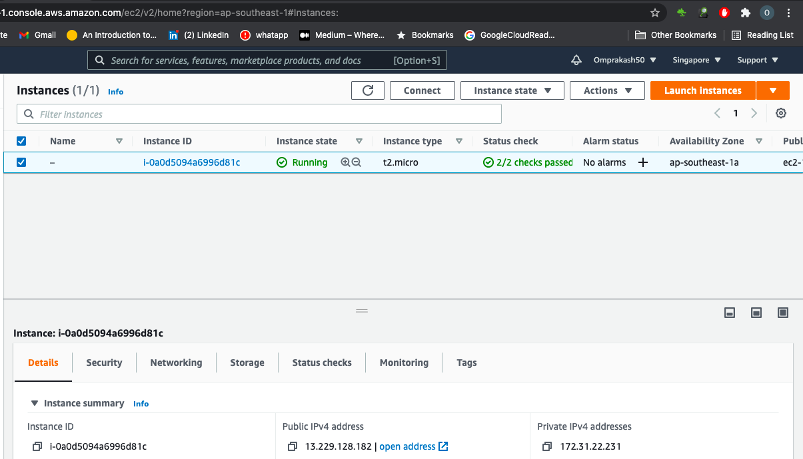
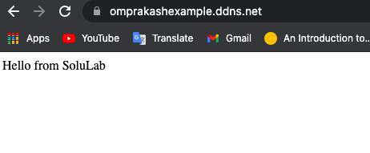

# Nginx_with_docker


## First launch instance

 

## For Giving Domain name to this instance i used noip.com


## Install and start nginx in  dockerhost (baseos):
```
$yum install nginx -y
$systemctl start nginx
```


## Now For SSL:

dnf install https://dl.fedoraproject.org/pub/epel/epel-release-latest-8.noarch.rpm
dnf install certbot python3-certbot-nginx
certbot certonly --standalone
Now type email and domain name, then certbot will provide public ip and private ip and will give path of those key's to us.


## Nginx conf file in dockerhost (baseos):

In nginx.conf file to listen 443 and to enable ssl write {Listen 443 ssl;}
And also give public ip and private ip path in front of keywords ssl_certificate and ssl_certificate_key respectively.


[root@ip-172-31-22-231 nginx]# cat nginx.conf
```
http {
    log_format  main  '$remote_addr - $remote_user [$time_local] "$request" '
                      '$status $body_bytes_sent "$http_referer" '
                      '"$http_user_agent" "$http_x_forwarded_for"';

    access_log  /var/log/nginx/access.log  main;

    sendfile            on;
    tcp_nopush          on;
    tcp_nodelay         on;
    keepalive_timeout   65;
    types_hash_max_size 2048;

 include /etc/nginx/conf.d/*.conf;

server {
      listen 80 default_server;
      ## set up domain name here ##
      server_name omprakashexample.ddns.net;
      access_log off;
      error_log off;
      return      301 https://$server_name$request_uri;
}

    server {
         listen  443 ssl http2; 

        ssl_certificate /etc/letsencrypt/live/omprakashexample.ddns.net/fullchain.pem;
        ssl_certificate_key /etc/letsencrypt/live/omprakashexample.ddns.net/privkey.pem; 
        ssl_protocols TLSv1.3;
location / {

    proxy_pass http://localhost:8080/;        
}
}

}

events { }
```


## Now this nginx which is located in docker host will do proxy at port no 8080, So idea is to expose docker container on port no 8080.


## Launching Container  : I am using CentOS image :
```
$docker run -it -p 8080:80 --name op centos
$yum install nginx -y              (install nginx)
$/usr/sbin/nginx                      (start nginx service)
```

## Docker container nginx configuration file:
```
[root@8e8c92dc43e1 nginx]# cat nginx.conf
user nginx;
worker_processes auto;
error_log /var/log/nginx/error.log;
pid /run/nginx.pid;

include /usr/share/nginx/modules/*.conf;

events {
    worker_connections 1024;
}
http {
    log_format  main  '$remote_addr - $remote_user [$time_local] "$request" '
                      '$status $body_bytes_sent "$http_referer" '
                      '"$http_user_agent" "$http_x_forwarded_for"';

    access_log  /var/log/nginx/access.log  main;

    sendfile            on;
    tcp_nopush          on;
    tcp_nodelay         on;
    keepalive_timeout   65;
    types_hash_max_size 2048;

    include             /etc/nginx/mime.types;
    default_type        application/octet-stream;

    include /etc/nginx/conf.d/*.conf;

    server {
        listen       80 default_server;
        listen       [::]:80 default_server;
        server_name  _;
        root         /usr/share/nginx/html;
        # Load configuration files for the default server block.
        include /etc/nginx/default.d/*.conf;

        location / {
        }
        error_page 404 /404.html;
            location = /40x.html {
        }

        error_page 500 502 503 504 /50x.html;
            location = /50x.html {
        }
    }
}
 
```
## Now create the webpage with content in docker container:
"Hello from SoluLab"


## Final ouput of http://omprakashexample.ddns.net/


 


>Thank you  
  
## Author
[**Ompraksh choudhari**](https://github.com/Omprakash50)
   
   [Linkedin](https://www.linkedin.com/in/omprakash-choudhari-252027196)
